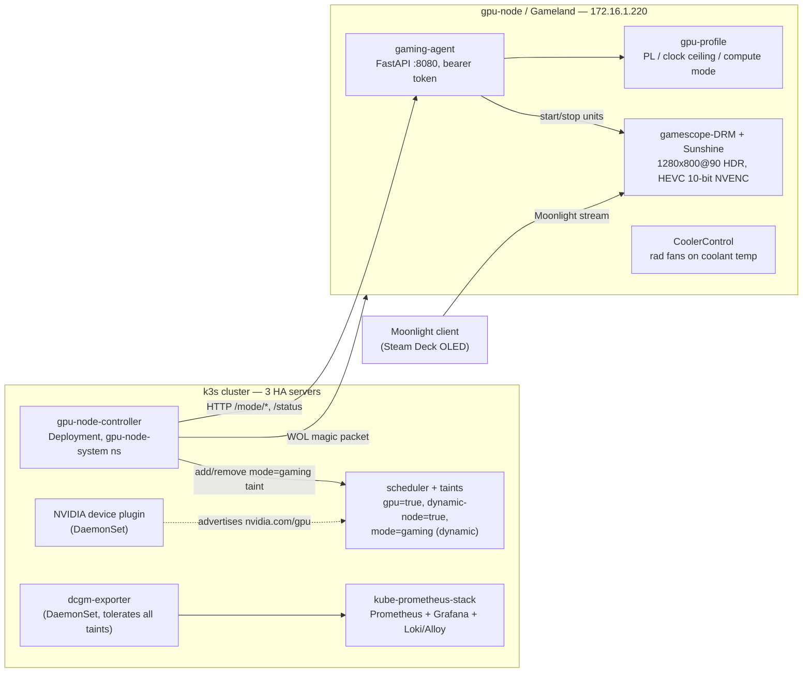
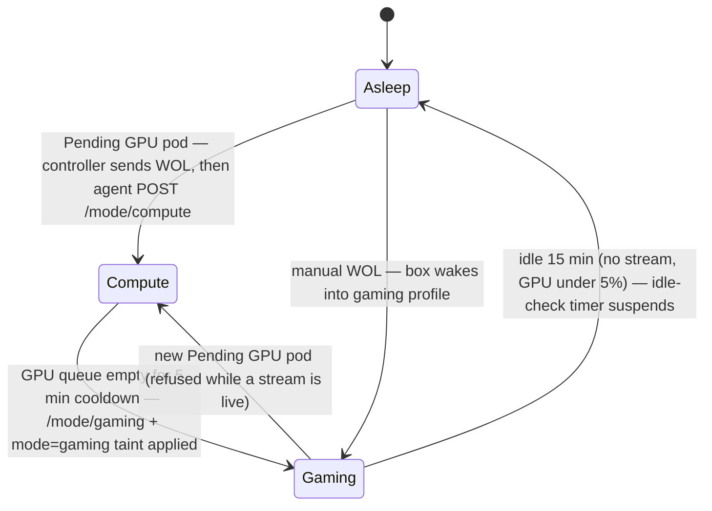

# gpu-node

One small-form-factor Arch Linux box ("Gameland", a FormD T1 with an
RTX 5080) with two mutually exclusive personalities: a k3s GPU
worker that runs ML training jobs, **or** a headless HDR game-streaming host
serving a Steam Deck over Moonlight. Never both. A cluster-side controller
arbitrates automatically: when GPU pods queue, it wakes the box via
Wake-on-LAN, tears down the gaming stack, and hands the GPU to Kubernetes;
when the queue drains, it flips the box back to gaming, and after 15 minutes
of idle the box suspends itself. The machine is asleep most of the week.

This is a real, running homelab system published as-is — RFC1918 addresses,
hostnames, hard-won mistakes and all. See [fork notes](#fork-notes) for
everything site-specific, and [lessons learned](#lessons-learned) for the
parts that cost actual weeks.

## Architecture



## Mode lifecycle



The controller is a small bash + kubectl + python3 loop in a Deployment
(details in [cluster/controller/](cluster/controller/)). The host-side agent
is the authoritative gate: it refuses a compute flip while a Moonlight client
is mid-stream, because yanking the GPU kills NVENC under the running game.

## Repo map

| Path | What |
|---|---|
| [host/](host/) | Curated host config payload, filesystem-mirror layout (`etc/`, `boot/`, `usr/`, `opt/`, `home/kai/`, `meta/` package lists). Rehydrate installs from here. |
| [cluster/controller/](cluster/controller/) | The arbitration controller: namespace, RBAC, secret template, control-loop ConfigMap, Deployment, test-flip script. |
| [cluster/device-plugin/](cluster/device-plugin/) | NVIDIA device plugin DaemonSet (tolerations tuned for this node's taints). |
| [cluster/monitoring/](cluster/monitoring/) | dcgm-exporter manifests + custom counter CSV, Grafana dashboard ConfigMaps, alert rules + provisioning script. |
| [rehydrate/](rehydrate/) | Disaster-recovery scripts: numbered host and cluster stages, each with `install.sh` / `verify.sh`. |
| [scripts/](scripts/) | `sync-from-host.sh` (pull live host config into `host/`), `gen-dashboard-configmap.sh`. |
| [docs/](docs/) | Setup, architecture, audio and streaming deep dives, lessons learned. |

## Hardware

| Component | Detail |
|---|---|
| Case | FormD T1 (SFF). Closed GPU compartment — the root cause of the Xid 79 saga below. |
| CPU | AMD Ryzen 7 5700X3D, 32 GB RAM |
| GPU | RTX 5080 16GB GDDR7 (Inno3D reference PCB), water-blocked, PCM thermal pad. Replaced the RTX 3080 on 2026-09-12; the Xid 79 history below is the 3080's. |
| Motherboard | ASUS ROG Strix B550-I |
| Cooling | Single shared CPU+GPU loop, one radiator. Alphacool DC-LT pump pinned at 100% — never on a curve. Bottom Noctua intake added to the GPU compartment (2026-05-25). |
| Storage | 1 TB Crucial P5 Plus NVMe — ESP / 32G swap (hibernate) / 150G root / rest home |
| NIC | Intel I225-V (`enp7s0`), WOL armed |
| Display | None. A valid Steam Deck EDID is kernel-injected (`drm.edid_firmware=`), so no HDMI dummy plug is needed — and a dummy plug wouldn't work anyway; see [docs/streaming.md](docs/streaming.md). |

## How the mutual exclusion works

Three layers, outermost first:

1. **Static taints** — the node carries `gpu=true:NoSchedule` and
   `dynamic-node=true:NoSchedule` permanently. Ordinary cluster workloads
   never land here; GPU jobs must opt in with tolerations.
2. **Dynamic `mode=gaming:NoSchedule` taint** — applied by the controller
   when the box is gaming, removed when it flips to compute. GPU jobs
   tolerate the static taints but *not* this one, so they queue as Pending
   while a game is running — which is exactly the signal the controller
   watches for.
3. **`EXCLUSIVE_PROCESS` compute mode** — set by `gpu-profile compute` as
   defense in depth: even if scheduling goes wrong, a second CUDA context
   can't co-tenant the GPU. The taints are the primary gate, not this.

The one deliberate exception: **dcgm-exporter tolerates all taints**, so GPU
telemetry flows in both modes — which is how the thermal forensics in the
lessons below were possible at all.

## Quickstart

```sh
git clone <this-repo> && cd gpu-node
```

Bare-metal bootstrap (partitioning, base Arch, nvidia-open driver, k3s join)
is documented in [docs/setup.md](docs/setup.md). After that, everything is
two commands:

```sh
./rehydrate/rehydrate.sh host both      # run on the box: install + verify all host stages
./rehydrate/rehydrate.sh cluster both   # run from any kubectl machine: cluster stages
```

Dashboard and alerts alone (onto an existing kube-prometheus-stack):

```sh
kubectl apply -f cluster/monitoring/dashboards/gpu-node-overview-configmap.yaml
python3 cluster/monitoring/alerting/apply.py
```

See [cluster/monitoring/README.md](cluster/monitoring/README.md) for the
details (including why the dcgm custom-counter CSV must be applied together
with the DaemonSet, or the throttle-reason panels show "No data").

## Fork notes

Published as-is from a real network. If you fork this, these are the values
to change — there is no templating layer, on purpose:

| Value | Mine | Lives in |
|---|---|---|
| Host static IP | `172.16.1.220/24` | [cluster/controller/04-configmap.yaml](cluster/controller/04-configmap.yaml) + [05-deployment.yaml](cluster/controller/05-deployment.yaml) (`AGENT_URL`), [host/home/kai/.config/sunshine/sunshine.conf](host/home/kai/.config/sunshine/sunshine.conf) (`csrf_allowed_origins`), [docs/setup.md](docs/setup.md) |
| Gateway / DNS | `172.16.1.254` (+ 1.1.1.1) | [docs/setup.md](docs/setup.md) |
| WOL MAC | `58:11:22:b0:a6:af` | [cluster/controller/04-configmap.yaml](cluster/controller/04-configmap.yaml) + [05-deployment.yaml](cluster/controller/05-deployment.yaml) (`NODE_MAC`) |
| NIC name | `enp7s0` | auto-detected by [rehydrate/host/30-network/install.sh](rehydrate/host/30-network/install.sh) (default-route interface) |
| User | `kai` (uid 1000) | `host/home/kai/`, [host/etc/sudoers.d/gaming-agent](host/etc/sudoers.d/gaming-agent), unit files |
| Hostname | `Gameland` | [sunshine.conf](host/home/kai/.config/sunshine/sunshine.conf) (`sunshine_name`, csrf origins), [docs/setup.md](docs/setup.md) |
| k8s node name | `gpu-node` | [host/etc/rancher/k3s/config.yaml](host/etc/rancher/k3s/config.yaml), referenced throughout `cluster/` |
| Registry mirror | `registry.homelab` → `http://172.16.1.89/v2` | [host/etc/rancher/k3s/registries.yaml](host/etc/rancher/k3s/registries.yaml) |
| k3s API servers | `https://172.16.1.1/.2/.3:6443` | prompted by [rehydrate/host/90-k3s-agent/install.sh](rehydrate/host/90-k3s-agent/install.sh), [docs/setup.md](docs/setup.md) |

**No secrets are tracked.** Exactly two exist, and both live only outside
git: the agent bearer token (`/etc/gaming-agent/token` on the host plus a k8s
Secret in `gpu-node-system` — generation recipe in
[host/etc/gaming-agent/token.example](host/etc/gaming-agent/token.example)
and [cluster/controller/03-secret.yaml.example](cluster/controller/03-secret.yaml.example)),
and Sunshine's credentials/pairing state (`sunshine_state.json`, deliberately
never synced into the repo). The k3s join token is never written anywhere
here either.

## Lessons learned

The differentiating content of this repo is the write-ups, not the YAML:

- [docs/lessons/xid79-gddr6x-heat-soak.md](docs/lessons/xid79-gddr6x-heat-soak.md)
  — a month of intermittent "GPU has fallen off the bus" under compute (never
  gaming). Every software hypothesis — new training deps, PSU transients,
  PCIe link, `EXCLUSIVE_PROCESS`, power-limit transients — was a red herring.
  Root cause: GDDR6X memory-junction heat-soak in a closed SFF compartment,
  invisible because consumer Ampere doesn't expose memory temperature and the
  die read a comfortable 65 °C while the memory cooked.
- [docs/streaming.md](docs/streaming.md) — why Steam Remote Play on Linux
  silently degrades to a ~20 fps desktop grab for most Vulkan/Proton titles,
  and the replacement: kernel-injected Steam Deck EDID → headless
  gamescope-DRM → Sunshine KMS HDR (HEVC 10-bit), including why only a
  *valid* injected EDID works and dummy plugs don't.
- [docs/audio.md](docs/audio.md) — host-side virtual surround for a stereo
  handheld via PipeWire filter-chains and HeSuVi impulse responses, including
  why naive HRTF stacking destroys distance perception in games.

## License

[MIT](LICENSE).
