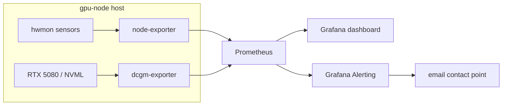

# gpu-node monitoring

Everything gpu-node-specific that rides on the cluster's existing
kube-prometheus-stack (v82.4.1, helm release `prometheus-stack`, namespace
`observability`): a DCGM exporter for GPU telemetry, one Grafana dashboard,
and five Grafana alert rules. Host sensors come in for free via the stack's
node-exporter DaemonSet. Logs ship via Loki + Grafana Alloy (not promtail).
Alertmanager is disabled — alerting lives in Grafana Alerting (see
[`alerting/`](alerting/)).

One frank note on posture: Grafana runs with anonymous-Admin
(`auth.anonymous.org_role: Admin`) — a deliberate homelab trade-off that is
only acceptable because Grafana is never exposed beyond the LAN. Don't
change one half of that without the other.



| Directory | What |
|---|---|
| [`dcgm-exporter/`](dcgm-exporter/) | GPU metrics DaemonSet + custom counter set |
| [`dashboards/`](dashboards/) | `gpu-node-overview` dashboard (JSON + generated ConfigMap) |
| [`alerting/`](alerting/) | 5 Grafana alert rules + `apply.py` provisioner |

## Host sensors (node-exporter / hwmon)

`prometheus-stack-prometheus-node-exporter` runs as a DaemonSet on every
node, gpu-node included. Its default flags enable the `hwmon` collector
with `/sys` mounted read-only, so every `/sys/class/hwmon/*` device on
gpu-node is already in Prometheus — no extra deploys.

The catch is mapping hwmon's anonymous `chip`/`sensor` labels to physical
sensors. **The table below is a worked example for THIS board** (ASUS ROG
Strix B550-I: `asus_ec_sensors` EC chip + Nuvoton NCT6798D Super-IO). Chip
names are board-specific — on any other hardware, rediscover them first:

```bash
# What hwmon chips does the node expose, and what do they call themselves?
kubectl -n observability exec prometheus-prometheus-stack-prometheus-0 -c prometheus -- \
  wget -qO- 'http://localhost:9090/api/v1/query?query=node_hwmon_chip_names{instance=~"172.16.1.220.*"}'
```

Then cross-reference against `sensors` output on the host until each
`{chip, sensor}` pair is identified. Validated mapping for gpu-node:

| Sensor | Selector | Notes |
|---|---|---|
| **Coolant water** | `node_hwmon_temp_celsius{chip="platform_asus_ec_sensors",sensor="temp4"}` | asusec `T_Sensor` — the 10kΩ NTC probe driving CoolerControl's watercurve |
| **CPU Tctl** | `node_hwmon_temp_celsius{chip="pci0000:00_0000:00:18_3",sensor="temp1"}` | k10temp `Tctl` — AMD-reported package temp |
| **CPU Tccd1 (die)** | `node_hwmon_temp_celsius{chip="pci0000:00_0000:00:18_3",sensor="temp3"}` | k10temp die-junction |
| **GPU die** | `DCGM_FI_DEV_GPU_TEMP` | nvidia-open 610 exposes no hwmon node for the RTX 5080 — DCGM is the only source |
| **Chipset** | `node_hwmon_temp_celsius{chip="platform_asus_ec_sensors",sensor="temp1"}` | asusec `Chipset` |
| **Motherboard** | `node_hwmon_temp_celsius{chip="platform_asus_ec_sensors",sensor="temp3"}` | asusec `Motherboard` |
| **NVMe** | `node_hwmon_temp_celsius{chip="nvme_nvme0",sensor="temp1"}` | Crucial P5 Plus `Composite` |
| **Rad fan 1** | `node_hwmon_fan_rpm{chip="platform_nct6775_656",sensor="fan1"}` | nct6798 `CPU_FAN` header |
| **Rad fan 2** | `node_hwmon_fan_rpm{chip="platform_nct6775_656",sensor="fan2"}` | nct6798 `CHA_FAN` header |
| **Pump** | `node_hwmon_fan_rpm{chip="platform_nct6775_656",sensor="fan5"}` | `AIO_PUMP` header — Alphacool DC-LT, ~2700 RPM constant |
| **VRM heatsink fan** | `node_hwmon_fan_rpm{chip="platform_asus_ec_sensors",sensor="fan1"}` | ~3900 RPM |
| **Rad fan PWM 1/2** | `node_hwmon_pwm{chip="platform_nct6775_656",sensor=~"pwm1\|pwm2"}` | 0–255 → ÷255×100 for % |
| **Pump PWM** | `node_hwmon_pwm{chip="platform_nct6775_656",sensor="pwm5"}` | held at 255 by design — the DC pump is never throttled |

Two gotchas:

- **nct6775 `temp3` (AUXTIN0) and `temp6` (AUXTIN3) are floating inputs**
  reading bogus 80-86°C constants. Never chart or alert on them.
- node-exporter series carry the exporter **pod's** labels (pod name churns
  on restarts). Aggregate them away (`max by (sensor) (...)`) unless you
  specifically need them.

The bottom Noctua intake fan in the GPU compartment (the Xid 79 fix) is not
on a monitored header — no metric for it.

## DCGM-exporter (GPU metrics)

NVIDIA's official exporter, deployed as a DaemonSet pinned to gpu-node.
Everything hwmon can't see: power draw, utilization, clocks, VRAM,
NVENC/NVDEC load, P-state, throttle reasons, Xid errors.

```bash
kubectl apply -f cluster/monitoring/dcgm-exporter/
```

That one command applies all four manifests (the ConfigMap lands before the
DaemonSet rolls, so the mount is satisfied):

- `01-rbac.yaml` — ServiceAccount in `gpu-node-system`
- `02-daemonset.yaml` — `nvcr.io/nvidia/k8s/dcgm-exporter:4.5.2-4.8.1-ubuntu22.04`
- `03-service-and-servicemonitor.yaml` — headless Service on :9400 +
  ServiceMonitor labeled `release: prometheus-stack` so Prometheus adopts it
- `04-custom-counters.yaml` — custom counter CSV (see below)

Design decisions baked into `02-daemonset.yaml`:

- **No `nvidia.com/gpu` resource request.** DCGM uses NVML, not CUDA;
  requesting the resource would compete with real workloads for the only
  GPU. Instead: `NVIDIA_VISIBLE_DEVICES=all` + `runtimeClassName: nvidia`,
  which injects driver libs/devices without claiming a device-plugin slot.
  NVML also works under `EXCLUSIVE_PROCESS`, so metrics keep flowing in
  compute mode.
- **Tolerates all three gpu-node taints** (`gpu`, `dynamic-node`,
  `mode=gaming`) — a monitoring exception. Regular compute pods must NOT
  tolerate `mode=gaming`; that taint is the gaming/compute mutual-exclusion
  lever.
- `SYS_ADMIN` capability (hardware-counter reads) instead of full
  privileged.
- Memory limit `1Gi` — DCGM 4.x OOMs instantly at 256Mi.

### Custom counter set (`04-custom-counters.yaml`)

The default counter set is blind to the one failure mode this box is known
for. `DCGM_FI_DEV_MEMORY_TEMP` reads a **constant 0 on consumer Ampere**
(NVML doesn't expose memory junction), yet GDDR6X junction heat-soak is
exactly what caused the Xid 79 crashes
([lesson](../../docs/lessons/xid79-gddr6x-heat-soak.md)). The only
software-visible signature is the SW Thermal Slowdown bit (0x20) in the
clock-event-reason bitmask firing while the die sits at a comfortable
65-70°C.

The custom CSV therefore adds, on top of the default set:

- `DCGM_FI_DEV_CLOCKS_EVENT_REASONS` — throttle-reason bitmask (0x20 = SW
  Thermal Slowdown = the heat-soak tell on this card)
- `DCGM_FI_DEV_PSTATE` — P-state (CUDA forces P2 by design; not a bug)
- `DCGM_FI_DEV_POWER_VIOLATION`, `DCGM_FI_DEV_THERMAL_VIOLATION`,
  `DCGM_FI_DEV_BOARD_LIMIT_VIOLATION`, `DCGM_FI_DEV_RELIABILITY_VIOLATION`
  — cumulative µs spent throttled, by cause

A custom CSV **replaces** the default set entirely, so the defaults are
repeated in the file. The DaemonSet points at it via
`DCGM_EXPORTER_COLLECTORS`.

> **Status:** `04-custom-counters.yaml` and the matching `02-daemonset.yaml`
> env are in the repo but **not yet applied to the running cluster**.
> Dashboard panels and the `gpu-thermal-violation` alert that use the new
> metrics show "No data" until the `kubectl apply -f` above is run.

One label gotcha: DCGM series carry the `namespace`/`pod`/`container`
labels of whichever pod currently holds the GPU. Always aggregate
(`max(...)`, `sum(increase(...))`) unless attribution is the point —
otherwise mode flips split your series.

## Dashboard

| File | What |
|---|---|
| [`dashboards/gpu-node-overview.json`](dashboards/gpu-node-overview.json) | **Source of truth.** Single combined dashboard, UID `gpu-node-overview`: at-a-glance stats, GPU performance (DCGM), cooling/thermals (hwmon), in collapsible rows |
| [`dashboards/gpu-node-overview-configmap.yaml`](dashboards/gpu-node-overview-configmap.yaml) | **Generated** ConfigMap wrapper — never edit by hand |

The kube-prometheus-stack Grafana sidecar (`grafana-sc-dashboard`
container) watches for ConfigMaps labeled `grafana_dashboard: "1"` and
loads them into Grafana within ~30 s. The `grafana_folder: gpu-node`
annotation files it under a "gpu-node" folder. Live at
`https://grafana.homelab/d/gpu-node-overview`.

Edit workflow:

```bash
# 1. edit dashboards/gpu-node-overview.json
# 2. regenerate the ConfigMap wrapper
scripts/gen-dashboard-configmap.sh
# 3. apply
kubectl apply -f cluster/monitoring/dashboards/gpu-node-overview-configmap.yaml
# 4. verify the sidecar picked it up
kubectl -n observability logs deploy/prometheus-stack-grafana -c grafana-sc-dashboard --tail=10
```

Editing the dashboard in the Grafana UI does NOT persist — the sidecar
overwrites it from the ConfigMap on the next tick. The JSON in git is the
source of truth; the [generator script](../../scripts/gen-dashboard-configmap.sh)
is the only thing that should touch the ConfigMap.

## Alerting

Five hardware-protection rules in [`alerting/`](alerting/), provisioned
into Grafana Alerting by `alerting/apply.py` (Alertmanager stays disabled):

| Rule | Severity | Catches |
|---|---|---|
| `gpu-pump-rpm-low` | critical | pump death — shared CPU+GPU loop, minutes to fry |
| `gpu-coolant-high` | warning | radiator limit / fans not ramping |
| `gpu-temp-high` | critical | loop failure at the GPU block |
| `gpu-thermal-violation` | warning | active throttling — on this card, GDDR6X heat-soak (needs the custom counters) |
| `gpu-xid-error` | critical | driver Xid errors; alert value = the Xid code |

All rules run with `noDataState: OK` because the box sleeps by design —
there is deliberately no up/down alert. Workflow, transports, and rationale
in [`alerting/README.md`](alerting/README.md).

## Not covered (honestly)

- **Sunshine session metrics** — bitrate, encode latency, FEC, connected
  client. Sunshine exports nothing Prometheus-shaped. Most practical path:
  Alloy already ships the journal to Loki, so parse `sunshine.service` log
  lines there (LogQL panels, or an Alloy stage extracting fields) rather
  than writing an exporter.
- **CoolerControl curve telemetry** — what the curve *requests* vs what the
  hardware reports. CC's REST API (`https://172.16.1.220:11987`) is
  auth-walled; would need a small custom exporter pod. hwmon PWM values
  cover most of the practical need.
