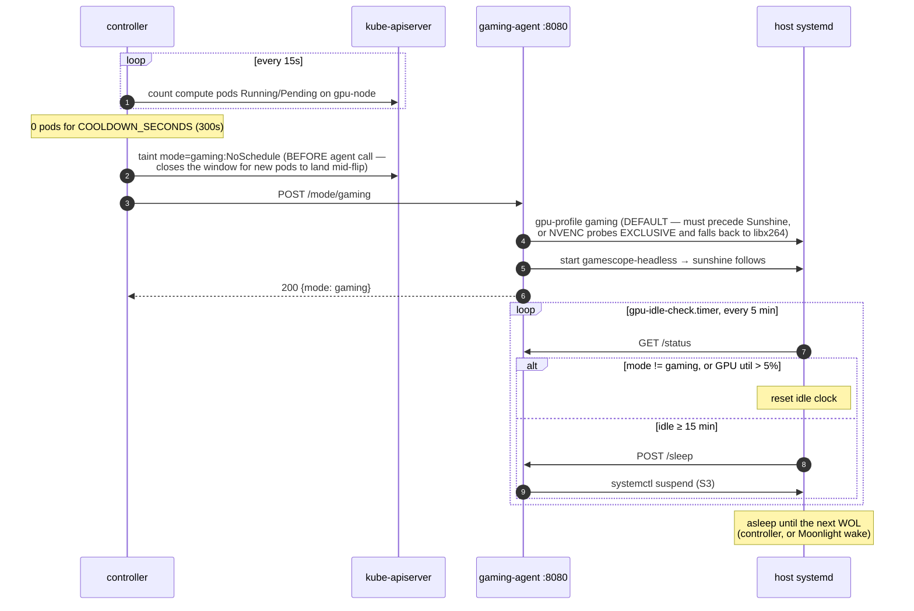
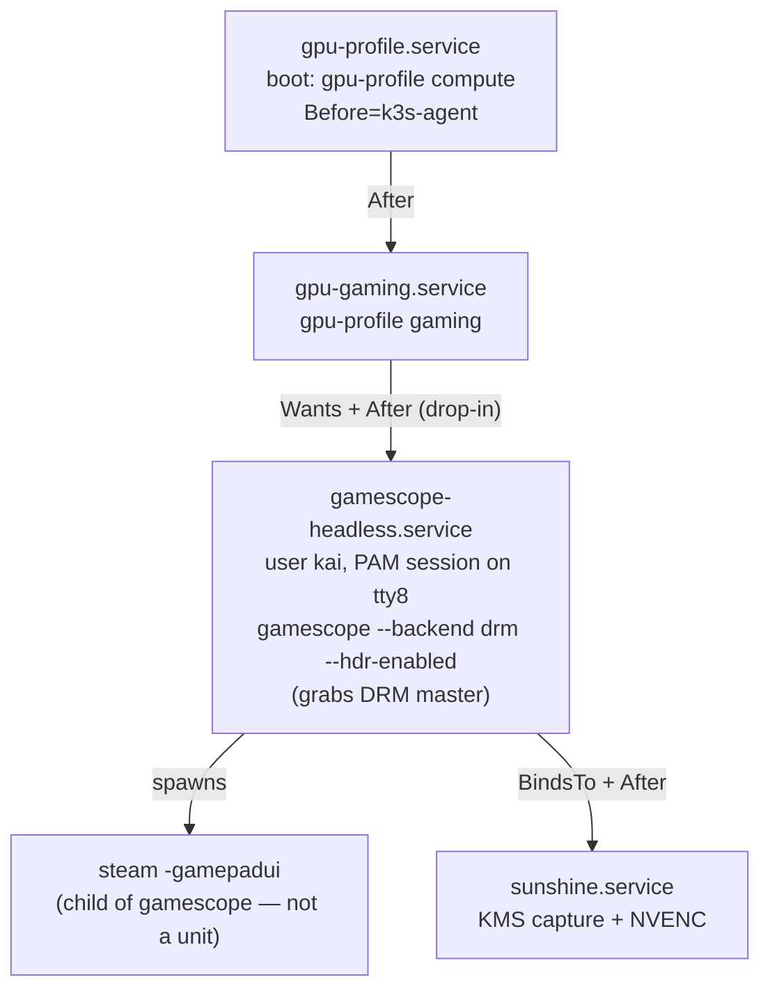

# Architecture — one GPU, two jobs, strict arbitration

One box ("Gameland", k8s node `gpu-node`: RTX 3080 10GB in a FormD T1, custom
water loop) serves two roles that must never overlap:

1. **Compute** — k3s GPU worker in a 3-server HA cluster, running ML training
   jobs.
2. **Gaming** — headless game-streaming host: gamescope on bare DRM at
   1280x800@90 HDR (kernel-injected Steam Deck EDID) + Sunshine KMS capture
   (HEVC 10-bit NVENC) → Moonlight on a Steam Deck OLED. See
   [streaming.md](streaming.md) and [audio.md](audio.md) for that stack's
   internals.

The box sleeps when neither role needs it (awake ~30% of a typical week) and
is woken by Wake-on-LAN — by a Moonlight client for gaming, by the cluster
controller for compute.

## Why mutual exclusion is strict

This isn't a "be polite, share the GPU" arrangement. Hard reasons:

- **NVENC dies under EXCLUSIVE_PROCESS.** Compute mode sets
  `compute_mode=EXCLUSIVE_PROCESS`; if that flips while Sunshine is
  streaming, Sunshine's NVENC session is yanked and the stream falls back to
  libx264 or dies, taking the running game with it. The agent is the
  authoritative gate: `/mode/compute` returns `409` if a Moonlight client is
  mid-stream, and the controller independently defers the flip. The order is
  always *stop the gaming stack, then change compute mode*.
- **10GB of VRAM is not enough for two tenants.** A game co-resident with a
  training job OOMs one or both. Training also wants deterministic
  throughput; a compositor + encoder stealing SMs ruins both experiences.
- **EXCLUSIVE_PROCESS in compute is defense in depth, not the gate.** The
  taint-level mutual exclusion (below) is the primary mechanism; the compute
  mode setting just prevents a second accidental CUDA context if something
  slips past it.

Per-mode GPU settings ([`host/usr/local/sbin/gpu-profile`](../host/usr/local/sbin/gpu-profile),
v3.0):

| | compute | gaming |
|---|---|---|
| Power limit | 370 W | 370 W |
| Core clock | `-lgc 0,2160` (boost ceiling lift) | same |
| Compute mode | `EXCLUSIVE_PROCESS` | `DEFAULT` |
| CPU governor | performance | performance |

(Both modes run full power since the thermal root cause of the Xid 79
crashes was fixed mechanically — see
[lessons/xid79-gddr6x-heat-soak.md](lessons/xid79-gddr6x-heat-soak.md).)

## How exclusion is enforced: taints

`gpu-node` joins the cluster with two **static** taints
([`host/etc/rancher/k3s/config.yaml`](../host/etc/rancher/k3s/config.yaml)):

| Taint | Why |
|---|---|
| `gpu=true:NoSchedule` | keeps generic cluster workloads off the GPU box |
| `dynamic-node=true:NoSchedule` | marks the node as one that sleeps; workloads must explicitly opt in to that lifecycle |

plus one **dynamic** taint, owned by the controller:

| Taint | Why |
|---|---|
| `mode=gaming:NoSchedule` | present while the box is in gaming mode (or asleep); removed only after the agent confirms the gaming stack is down |

A compute workload must tolerate the two static taints and **must not**
tolerate `mode=gaming` — that's the whole contract. While the taint is on,
GPU pods sit Pending; the controller notices, arbitrates, and removes it.

## Component inventory

| Component | Runs | Source |
|---|---|---|
| **gpu-node-controller** | cluster Deployment, `gpu-node-system` ns, 1 replica (`Recreate` — two controllers would fight over the taint), `hostNetwork: true`, anti-affinity pinning it *off* gpu-node | [`cluster/controller/`](../cluster/controller/) |
| **gaming-agent** | host, FastAPI on `:8080`, system user `gaming-agent`, bearer-token auth | [`host/opt/gaming-agent/agent.py`](../host/opt/gaming-agent/agent.py) |
| **gpu-profile** | host script applying the per-mode table above | [`host/usr/local/sbin/gpu-profile`](../host/usr/local/sbin/gpu-profile) |
| **gaming stack** | host units: `gamescope-headless.service` + `sunshine.service` (+ watchdog, QoS) | [`host/etc/systemd/system/`](../host/etc/systemd/system/) |
| **idle auto-suspend** | host: `gpu-idle-check.timer` (every 5 min) → [`idle-check.sh`](../host/opt/gaming-agent/idle-check.sh) | same |
| **boot profile chain** | host: `gpu-profile.service` (compute, `Before=k3s-agent`) → `gpu-gaming.service` → gaming stack; a reboot lands in gaming mode | same |
| **NVIDIA device plugin** | cluster DaemonSet exposing `nvidia.com/gpu` | [`cluster/device-plugin/`](../cluster/device-plugin/) |
| **dcgm-exporter** | cluster DaemonSet — the monitoring exception, see below | [`cluster/monitoring/dcgm-exporter/`](../cluster/monitoring/dcgm-exporter/) |

The controller is deliberately primitive: `alpine:3.20` + `bash` + `kubectl`
+ `jq` + a ~200-line poll loop in a ConfigMap
([`04-configmap.yaml`](../cluster/controller/04-configmap.yaml)). No CRDs, no
operator framework. Knobs (env on the Deployment): `POLL_INTERVAL=15`,
`COOLDOWN_SECONDS=300`, `WOL_READY_TIMEOUT=120`.

## Wake-for-work: gaming → compute

A "compute pod" to the controller is: `status.phase=Pending`, requests
`nvidia.com/gpu`, and tolerates *both* static taints.

```mermaid
sequenceDiagram
    autonumber
    participant J as GPU pod (Pending)
    participant K as kube-apiserver
    participant C as controller<br/>(cluster, hostNetwork)
    participant N as gpu-node host
    participant A as gaming-agent :8080

    J->>K: created; blocked by mode=gaming taint
    loop every 15s
        C->>K: count Pending GPU pods that tolerate gpu + dynamic-node
    end
    Note over C: pending > 0 → arbitrate
    C->>A: GET /status — Moonlight mid-stream?
    alt streaming_active
        Note over C: defer; recheck next loop
    else idle
        opt node NotReady (asleep)
            C-->>N: WOL magic packet (UDP broadcast :9, MAC 58:11:22:b0:a6:af)
            C->>K: wait for node Ready (≤120s)
        end
        C->>A: POST /mode/compute (Bearer token)
        A->>N: stop gamescope-headless (sunshine cascades via BindsTo)
        A->>N: gpu-profile compute (PL370, lgc lift, EXCLUSIVE_PROCESS)
        A-->>C: 200 {mode: compute}
        C->>K: kubectl taint nodes gpu-node mode-
        K->>N: pod schedules and runs
    end
```

The agent double-checks the stream gate itself (409 if a client is
connected) — the controller deferring is a courtesy, the agent refusing is
the guarantee.

## Return path: compute → gaming → suspend



The 300s cooldown tolerates brief gaps between queued Jobs; raise it for
batch pipelines with multi-minute setup gaps. The host-side idle check
**never** sleeps the box in compute mode — the controller owns that
lifecycle; the host only self-suspends from idle gaming mode.

On controller start, a bootstrap pass aligns the taint with the
agent-reported mode (taint applied defensively if the agent is unreachable —
the box might be asleep). There's also a divergence detector: compute pods
found Running on the node while the taint says gaming (happens when a reboot
re-flips to gaming under stranded pods) → the controller removes the taint to
match reality but does *not* flip profiles under a live workload; the next
idle window does a clean flip.

## Failure philosophy: log and hold, never guess

The controller never "fixes" a failed flip by force:

- **`/mode/compute` fails** → the gaming taint stays on, pods stay Pending,
  the controller logs and retries next loop. Pending pods are cheap; a
  half-torn-down gaming stack with a compute job on top is not.
- **`/mode/gaming` fails** → the taint is already applied (so at least no
  compute lands), the log says `INVESTIGATE`, and it retries. Worst case the
  box sits in a tainted no-man's-land — safe, just useless, and visible in
  the logs.
- **Agent unreachable** → assume gaming, taint defensively.

### Manual escape hatches

Everything the controller does, you can do by hand:

```bash
# Talk to the agent directly (from the 172.16.1.x network):
TOKEN=$(ssh kai@172.16.1.220 'sudo cat /etc/gaming-agent/token')
curl -fsS -H "Authorization: Bearer $TOKEN" http://172.16.1.220:8080/status
curl -fsS -X POST -H "Authorization: Bearer $TOKEN" http://172.16.1.220:8080/mode/compute
curl -fsS -X POST -H "Authorization: Bearer $TOKEN" http://172.16.1.220:8080/mode/gaming

# Manage the taint yourself:
kubectl taint nodes gpu-node mode-                              # open for compute
kubectl taint nodes gpu-node mode=gaming:NoSchedule --overwrite # close it
```

[`cluster/controller/test-flip.sh`](../cluster/controller/test-flip.sh) is a
scripted end-to-end round trip (pending pod → flip → run → flip back). Don't
run it while streaming.

### WOL VLAN caveat

The magic packet is a UDP broadcast to `255.255.255.255:9` — **it does not
cross VLANs**. The controller works because it runs `hostNetwork: true` on a
cluster node sitting on the same `172.16.1.0/24` as gpu-node. A laptop on
another VLAN (e.g. `172.20.1.x`) cannot wake the box directly: either submit
a tolerating GPU pod and let the controller do it, or `kubectl exec` into any
pod with host networking on the right segment and send the packet from there.

## The monitoring exception

Exactly one workload is allowed to ignore the arbitration:
[`dcgm-exporter`](../cluster/monitoring/dcgm-exporter/02-daemonset.yaml)
tolerates all **three** taints (`gpu`, `dynamic-node`, *and* `mode=gaming`)
so GPU telemetry flows in both modes — thermal and clocks-event data from
gaming sessions is exactly what diagnosed the Xid 79 saga. It's safe because
DCGM observes via NVML without creating a CUDA context, so it coexists with
EXCLUSIVE_PROCESS and never competes for the GPU. When the box sleeps, the
metrics simply gap — that's "asleep", not "down" (monitoring specifics live
in [`cluster/monitoring/README.md`](../cluster/monitoring/README.md)).

## Gaming stack: the DRM-master ordering invariant

On a headless box with no display server, **gamescope must acquire DRM
master before Sunshine's KMS capture attaches**. Get it backwards and you get
a black stream or a capture of nothing. The unit graph encodes this:



Load-bearing details:

- `sunshine.service` has `BindsTo=gamescope-headless.service` + `After=` —
  Sunshine can't start before gamescope and cascade-stops with it. A drop-in
  adds an `ExecStartPre` wait-loop that polls for the `gamescope-wl` and
  `steam` processes before letting Sunshine attach, so KMS capture never
  races the compositor's DRM-master grab.
- Steam runs *inside* gamescope (`gamescope ... -- steam -gamepadui` in
  [`gamescope-headless.sh`](../host/usr/local/bin/gamescope-headless.sh)) —
  it is not a separate unit and needs no ordering of its own.
- **Restart rule** (also encoded in the agent): stop sunshine → restart
  gamescope → start sunshine. Restarting gamescope under a live Sunshine
  leaves Sunshine holding a stale KMS handle.
- A `TimeoutStopSec=20` drop-in on gamescope-headless keeps stops inside the
  agent's 60s budget (gamescope's default 90s SIGTERM wait would blow past
  it). SIGKILL at 20s is safe — Steam state is persisted before the session
  starts.
- The flip ordering differs by direction, for the same NVENC reason: going
  to *compute*, stop the stack first, then change compute mode; going to
  *gaming*, set `DEFAULT` first, then start the stack.

## Trust model

Homelab threat model: protect against accidents and over-curious LAN
devices, not nation-states. Layers, narrowest first:

- **Bearer token** — `openssl rand -hex 32`, generated on the host at
  install (rehydrate `host/85`). Lives in exactly two places:
  `/etc/gaming-agent/token` on the host (`640 root:gaming-agent`) and the
  `gpu-node-controller-secret` k8s Secret on the cluster. Never in the repo
  ([`03-secret.yaml.example`](../cluster/controller/03-secret.yaml.example)
  is a template). The agent speaks plain HTTP on the LAN — the token gates
  *who can flip modes*, it is not transport secrecy.
- **Agent privilege** — `gaming-agent` is a nologin system user. Its sudoers
  entry ([`host/etc/sudoers.d/gaming-agent`](../host/etc/sudoers.d/gaming-agent))
  whitelists exactly eight commands: start/stop of
  `gamescope-headless.service` and `sunshine.service`, `systemctl
  suspend`/`hibernate`, and `gpu-profile compute`/`gaming` — no shells, no
  wildcards. A compromised agent can annoy you, not own the box.
- **Controller RBAC** — the ClusterRole
  ([`02-rbac.yaml`](../cluster/controller/02-rbac.yaml)) grants
  `nodes: get/list/watch/patch` (the taint) and `pods: get/list/watch`
  (the counting). No secrets access beyond its own mounted one, no exec, no
  create/delete on anything.
- **Blast-radius placement** — the controller is forbidden from scheduling
  on gpu-node itself (it would vanish every time the box sleeps), and
  `Recreate` strategy guarantees a single instance.
