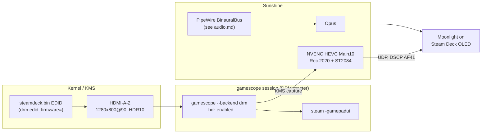

# Streaming a headless NVIDIA box to a Steam Deck

How Gameland streams games: a headless Arch box (RTX 3080 10GB, nvidia-open
595.71.05, no monitor, no dummy plug) running gamescope on bare DRM with a
kernel-injected Steam Deck EDID, captured by Sunshine over KMS, decoded by
Moonlight on a Steam Deck OLED — 1280×800@90, HDR10, HEVC 10-bit.

It did not start out this way. This doc is the story of why each piece is
there, because every piece replaced something that looked simpler and didn't
work.



## 1. Why not Steam Remote Play: the Linux Vulkan-capture bug

The first iteration of this box used Steam Remote Play — no extra software,
native Deck integration. It produced a maddening split: **Hogwarts Legacy
streamed at a flat 120 fps at 35–40% GPU, while Witchfire was stuck at
20–30 fps** on the same host, same session, same encoder.

Steam's own frame-timing log (`~/.local/share/Steam/logs/streaming_log.txt`,
grep `Slow framerate`) gave the diagnosis:

```
CaptureDescriptionID = "Desktop OpenGL NV12 + NVENC HEVC"
Slow framerate: game 0.00 ms, capture ~2 ms, encode 30–49 ms  (blamed: encode)
```

Two details matter:

- `game 0.00 ms` — the GPU renders the frame essentially instantly. The host
  is not slow.
- `CaptureDescriptionID = "Desktop OpenGL …"` — Steam is using its
  **desktop-grab fallback**, not the game-capture fast path. A healthy
  session reports a *game* capture description. The 30–49 ms charged to
  "encode" is the desktop readback + copy + NVENC submit serialised on one
  path, not a real 30 ms encode (the same NVENC does 120 fps for Hogwarts).

This is a known, years-old, unfixed Valve defect: **Steam Remote Play on
Linux does not fast-capture Vulkan-presenting games** (native Vulkan, and
DX→Vulkan via Proton/VKD3D on the affected path). They fall back to desktop
capture and pin at ~20–25 fps regardless of render speed. Tracked in
ValveSoftware/steam-for-linux as
[#11053](https://github.com/ValveSoftware/steam-for-linux/issues/11053)
(the canonical report — the numbers match this box almost exactly), with
[#5591](https://github.com/ValveSoftware/steam-for-linux/issues/5591),
[#6738](https://github.com/ValveSoftware/steam-for-linux/issues/6738) and
[#9332](https://github.com/ValveSoftware/steam-for-linux/issues/9332) as
related/duplicate reports. There is no host-side setting that fixes it.

So: Witchfire (native Vulkan, UE5) hit the broken path; Hogwarts (VKD3D, but
presenting in a way Steam can fast-capture) didn't. Every host-tuning lever
was tested and exonerated — OC, P-states, PowerMizer registry knobs, bitrate
(a real but lossy mitigation), MangoHud's implicit Vulkan layer. The
community-correct fix is GPU-side capture: **Sunshine + Moonlight**. That is
why Sunshine exists on this box.

## 2. The headless EDID problem on nvidia-open

Sunshine needs something to capture, and modern Sunshine on this stack means
KMS capture of a real DRM plane. A headless NVIDIA box has no display, so
you have to convince the kernel there is one. On `nvidia-open` this is much
narrower than the internet suggests:

- **HDMI dummy plugs don't work.** `nvidia-modeset` cannot read a dummy
  plug's EDID over DDC at the KMS layer. (The legacy Xorg escape hatch —
  `ModeValidation "NoEdidModes, AllowNonEdidModes…"` + hand-written
  modelines — worked, but dies with Xorg, and the whole point was to drop
  the Xorg/desktop-grab stack.)
- **Invalid injected EDIDs are silently ignored.** `nvidia-modeset`
  validates `drm.edid_firmware` payloads; a hand-rolled or truncated EDID is
  dropped without any error and the connector stays modeless.
- **`/sys/class/drm/*/edid` is always empty on NVIDIA** — even when
  injection succeeded. Do not use it to verify. Check the `modes` file
  instead:

  ```
  $ cat /sys/class/drm/card*-HDMI-A-2/modes
  1280x800
  ```

  Modes present = EDID accepted. Empty `edid` file means nothing.

### The working recipe

1. **A real, valid EDID.** This box injects an actual Steam Deck panel EDID
   (256 bytes, includes HDR10/ST2084 metadata — exactly the display we're
   pretending to be), from
   [Bloodhundur/steamdeckedid](https://github.com/Bloodhundur/steamdeckedid),
   vendored at [`host/usr/lib/firmware/edid/steamdeck.bin`](../host/usr/lib/firmware/edid/steamdeck.bin).
2. **Kernel-inject it and force the connector on** — from
   [`host/boot/loader/entries/arch.conf`](../host/boot/loader/entries/arch.conf):

   ```
   nvidia_drm.modeset=1 nvidia_drm.fbdev=1
   drm.edid_firmware=HDMI-A-2:edid/steamdeck.bin video=HDMI-A-2:e
   ```

   The EDID lives under `/usr/lib/firmware`, so rebuild the initramfs
   (`mkinitcpio -P`) after placing it.
3. **gamescope drives the connector directly** as DRM master —
   [`host/usr/local/bin/gamescope-headless.sh`](../host/usr/local/bin/gamescope-headless.sh):

   ```
   gamescope --backend drm --prefer-output HDMI-A-2 \
             -W 1280 -H 800 -r 90 --hdr-enabled -e -- steam -gamepadui
   ```

4. **Sunshine captures over KMS** with HDR intact: Rec.2020 primaries +
   SMPTE ST2084 (PQ) transfer, encoded as HEVC Main10 by NVENC. The Deck
   OLED displays real HDR at the other end.

Historical note: gamescope's DRM backend originally SIGSEGV'd on this stack
and was written off. The crash was downstream of the modeless connector —
once a valid EDID is injected, gamescope-DRM runs fine. If gamescope dies
instantly on a headless NVIDIA box, check `modes` before blaming gamescope.

## 3. The DRM-master ordering invariant

There is exactly one DRM master. gamescope must hold it **before** Sunshine
attaches its KMS capture. Get the order wrong and Sunshine spams
`drmModeAtomicCommit: Permission denied` while the client shows a black
stream with working audio — a uniquely confusing failure.

The ordering is enforced in systemd, not in anyone's memory:

- [`sunshine.service`](../host/etc/systemd/system/sunshine.service) has
  `BindsTo=gamescope-headless.service` + `After=gamescope-headless.service`,
  so Sunshine cannot outlive or predate the compositor.
- A [drop-in `ExecStartPre`](../host/etc/systemd/system/sunshine.service.d/10-wait-gamescope.conf)
  wait-loop holds Sunshine until `gamescope-wl` and `steam` processes
  actually exist (unit ordering alone races against gamescope's startup).

**Restart rule** (also what the mode-switch agent does): stop `sunshine` →
restart `gamescope-headless` → start `sunshine`. Never bounce gamescope
under a live Sunshine.

## 4. Hard limits on this hardware

Things that are not bugs and not fixable; documented so nobody chases them
again:

- **No AV1.** GA102/Ampere has no AV1 encoder; `av1_nvenc` reports "No
  capable devices found". Moonlight's "host doesn't support AV1" message is
  expected and permanent on this GPU. HEVC 8/10-bit works fine.
- **P2 pstate under any CUDA/NVENC context, by design.** Consumer GeForce
  drops to P2 whenever a CUDA or NVENC context exists; memory clock is
  capped at 9251 MHz (P0 would be 9501). `nvidia-smi -lmc` is
  accepted-but-ignored. Cost is ~3% memory throughput — irrelevant to
  streaming. See the [Xid 79 postmortem](lessons/xid79-gddr6x-heat-soak.md)
  for the rest of the clock story.
- **The eglcore teardown segfault is cosmetic.** Stopping the gamescope
  session logs a SIGSEGV (status=11) in `libnvidia-eglcore` during
  teardown, after the last frame has been delivered. The unit runs
  `Restart=no`; the agent's flip path tolerates it. Annoying in the
  journal, harmless in practice.

## 5. What runs today

| Piece | Setting | Where |
|---|---|---|
| Display | HDMI-A-2, 1280×800@90, HDR10, kernel-injected Deck EDID | [`host/boot/loader/entries/arch.conf`](../host/boot/loader/entries/arch.conf) |
| Compositor | gamescope DRM backend, `--hdr-enabled`, launches `steam -gamepadui` | [`host/usr/local/bin/gamescope-headless.sh`](../host/usr/local/bin/gamescope-headless.sh) |
| Session unit | tty8 login session via `PAMName=login`, caps dropped (Steam bwrap) | [`host/etc/systemd/system/gamescope-headless.service`](../host/etc/systemd/system/gamescope-headless.service) + [drop-ins](../host/etc/systemd/system/gamescope-headless.service.d/) |
| Capture/encode | Sunshine `capture = kms`, `encoder = nvenc`, HEVC Main10 HDR | [`host/home/kai/.config/sunshine/sunshine.conf`](../host/home/kai/.config/sunshine/sunshine.conf) |
| Bitrate | `max_bitrate = 50000`, `fec_percentage = 5` | same |
| Input | `gamepad = xone` (Xbox One pad emulation — `ds5` was trialled for gyro but retired); keyboard/mouse disabled | same |
| Audio | Sunshine captures `BinauralBus` (host-side binaural; Moonlight client set to STEREO) | [audio.md](audio.md) |
| QoS | DSCP AF41 on Sunshine UDP egress (47998–48010) | [`host/etc/nftables.d/sunshine-qos.nft`](../host/etc/nftables.d/sunshine-qos.nft) |
| Disconnect | watchdog kills the running game on `CLIENT DISCONNECTED` (+20 s retry) | [`host/etc/systemd/system/sunshine-disconnect-watchdog.service`](../host/etc/systemd/system/sunshine-disconnect-watchdog.service) |
| GPU mode | `gpu-profile gaming` (compute_mode=DEFAULT — required) at session start | [`host/usr/local/sbin/gpu-profile`](../host/usr/local/sbin/gpu-profile) via [`gpu-gaming.service`](../host/etc/systemd/system/gpu-gaming.service) |

Unit chain: `gpu-gaming.service` → `gamescope-headless.service` →
`sunshine.service` (BindsTo). The whole stack is started and stopped by the
mode-switch agent — see [architecture.md](architecture.md).

Remaining gotchas baked into that config, learned the hard way:

- **`max_bitrate = 50000` is a ceiling, not a target.** Without it, an
  IDR-keyframe feedback spiral can inflate actual throughput to 150+ Mbps
  over a 30 Mbps client slider and shred the Wi-Fi link. FEC adds parity
  overhead on top — currently dialled down to 5% on a clean link (it was
  run as high as 20% while chasing Wi-Fi loss).
- **`csrf_allowed_origins` must be a plain comma-separated list.** A JSON
  array is silently rejected — the web UI just stops accepting logins with
  no error.
- **NVENC needs `compute_mode = DEFAULT`.** If the box is left in
  EXCLUSIVE_PROCESS (compute mode), NVENC can't allocate a context next to
  Steam and Sunshine silently falls back to software libx264. That is what
  `gpu-gaming.service` exists to prevent, and why the agent never flips to
  compute while a stream is live.
- No credentials live in `sunshine.conf`; pairing state and web-UI creds
  are in `sunshine_state.json`, which is deliberately never synced into
  this repo.

## 6. Multi-resolution clients (stream-res)

The injected EDID advertises more than the Deck's native mode (1080p, 1440p,
4K are all in the KMS mode list), but gamescope fixes its output mode at
launch — so serving a different client resolution pixel-natively means
restarting the stack in the other mode. `stream-res` (run over SSH) does
that in the DRM-master-safe order from §3, with auto-revert to the Deck
default if the requested mode doesn't come up:

```
stream-res status     # current override + live mode
stream-res 1080p      # iPad: 1920x1080@60
stream-res 1440p      # 2560x1440@60
stream-res 2560x1600@60   # any WxH[@R] the EDID offers
stream-res deck       # back to 1280x800@90 (removes the override)
```

Mechanics: the override lives in `/etc/gamescope-headless/resolution`
(`GS_W/GS_H/GS_R`, sourced by `gamescope-headless.sh`; absent = Deck
native). The switch restarts gamescope + Sunshine (~20 s, Steam session
included) and refuses to run while a Moonlight client is connected unless
`--force`. The override clears on every reboot (`tmpfiles.d`) — the box always boots Deck-native; within a boot it persists across service restarts until changed.
Without a switch, a client requesting a non-matching resolution still
works: Sunshine scales the current output into the requested size (softer,
letterboxed across aspect ratios).
